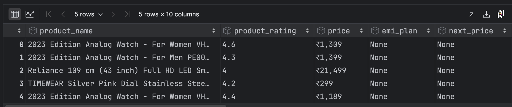
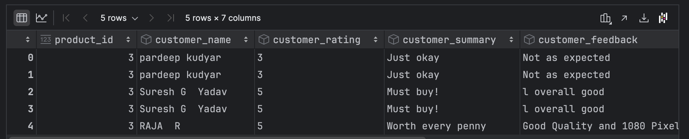
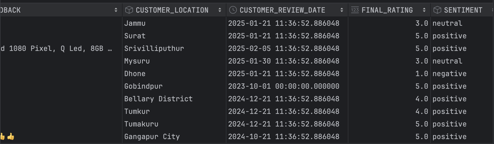
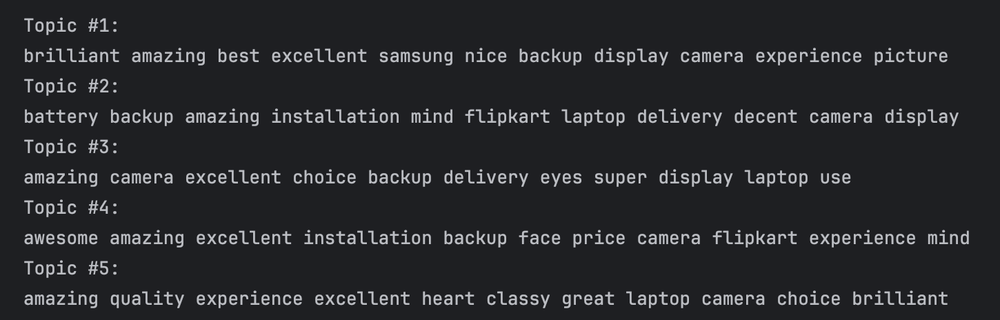
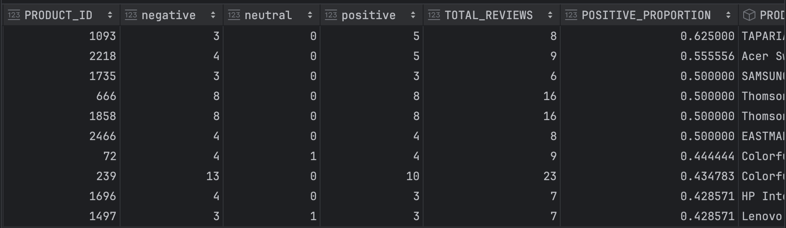

REVIEWXTRACT

<h3>Data Sources</h3>

<table border="0" cellpadding="0" cellspacing="0" width="864" style="">
  <thead>
    <tr height="45" style="height: 34pt;">
      <th>Document Name</th>
      <th>Details</th>
      <th>Reference Link</th>
    </tr>
  </thead><colgroup><col width="297" style="width: 223pt;"><col width="328" style="width: 246pt;"><col width="239" style="width: 179pt;"></colgroup>
  <tbody>
    <tr height="45" style="height: 34pt;">
      <td height="45" class="xl65" width="297" style="padding-top: 1px; padding-right: 1px; padding-left: 1px; font-size: 12pt; font-family: &quot;Aptos Narrow&quot;, sans-serif; vertical-align: middle; border-width: medium 0.5pt 0.5pt; border-style: none solid solid; border-color: currentcolor windowtext windowtext; border-image: none; text-align: center; height: 34pt; width: 223pt;">Entities_List.csv</td>
      <td class="xl65" width="328" style="padding-top: 1px; padding-right: 1px; padding-left: 1px; font-size: 12pt; font-family: &quot;Aptos Narrow&quot;, sans-serif; vertical-align: middle; border-width: medium 0.5pt 0.5pt medium; border-style: none solid solid none; border-color: currentcolor windowtext windowtext currentcolor; border-image: none; text-align: center; width: 246pt;">This file contains a list of entities extracted during the analysis process. These entities are identified from the data and used for further examination and categorization in this project.</td>
      <td class="xl65" width="239" style="padding-top: 1px; padding-right: 1px; padding-left: 1px; font-size: 12pt; font-family: &quot;Aptos Narrow&quot;, sans-serif; vertical-align: middle; border-width: medium 0.5pt 0.5pt medium; border-style: none solid solid none; border-color: currentcolor windowtext windowtext currentcolor; border-image: none; text-align: center; width: 179pt;"></td>
    </tr>
    <tr height="45" style="height: 34pt;">
      <td height="45" class="xl65" width="297" style="padding-top: 1px; padding-right: 1px; padding-left: 1px; font-size: 12pt; font-family: &quot;Aptos Narrow&quot;, sans-serif; vertical-align: middle; border-width: medium 0.5pt 0.5pt; border-style: none solid solid; border-color: currentcolor windowtext windowtext; border-image: none; text-align: center; height: 34pt; width: 223pt;">Tokens_List.csv</td>
      <td class="xl65" width="328" style="padding-top: 1px; padding-right: 1px; padding-left: 1px; font-size: 12pt; font-family: &quot;Aptos Narrow&quot;, sans-serif; vertical-align: middle; border-width: medium 0.5pt 0.5pt medium; border-style: none solid solid none; border-color: currentcolor windowtext windowtext currentcolor; border-image: none; text-align: center; width: 246pt;">This file holds the tokens generated during the process run. These tokens are crucial for analysis and are used to represent the text data in a structured form, enabling deeper insights during text-based operations.</td>
      <td class="xl65" width="239" style="padding-top: 1px; padding-right: 1px; padding-left: 1px; font-size: 12pt; font-family: &quot;Aptos Narrow&quot;, sans-serif; vertical-align: middle; border-width: medium 0.5pt 0.5pt medium; border-style: none solid solid none; border-color: currentcolor windowtext windowtext currentcolor; border-image: none; text-align: center; width: 179pt;"></td>
    </tr>
    <tr height="68" style="height: 51pt;">
      <td height="68" class="xl65" width="297" style="padding-top: 1px; padding-right: 1px; padding-left: 1px; font-size: 12pt; font-family: &quot;Aptos Narrow&quot;, sans-serif; vertical-align: middle; border-width: medium 0.5pt 0.5pt; border-style: none solid solid; border-color: currentcolor windowtext windowtext; border-image: none; text-align: center; height: 51pt; width: 223pt;">Source Code.ipynb</td>
      <td class="xl65" width="328" style="padding-top: 1px; padding-right: 1px; padding-left: 1px; font-size: 12pt; font-family: &quot;Aptos Narrow&quot;, sans-serif; vertical-align: middle; border-width: medium 0.5pt 0.5pt medium; border-style: none solid solid none; border-color: currentcolor windowtext windowtext currentcolor; border-image: none; text-align: center; width: 246pt;">This Jupyter notebook contains the source code used for executing the various steps of this project. It includes data preprocessing, analysis workflows, model development, visualization and etc.</td>
      <td class="xl65" width="239" style="padding-top: 1px; padding-right: 1px; padding-left: 1px; font-size: 12pt; font-family: &quot;Aptos Narrow&quot;, sans-serif; vertical-align: middle; border-width: medium 0.5pt 0.5pt medium; border-style: none solid solid none; border-color: currentcolor windowtext windowtext currentcolor; border-image: none; text-align: center; width: 179pt;">-</td>
    </tr>
    <tr height="45" style="height: 34pt;">
      <td height="45" class="xl65" width="297" style="padding-top: 1px; padding-right: 1px; padding-left: 1px; font-size: 12pt; font-family: &quot;Aptos Narrow&quot;, sans-serif; vertical-align: middle; border-width: medium 0.5pt 0.5pt; border-style: none solid solid; border-color: currentcolor windowtext windowtext; border-image: none; text-align: center; height: 34pt; width: 223pt;">product_data.json</td>
      <td class="xl65" width="328" style="padding-top: 1px; padding-right: 1px; padding-left: 1px; font-size: 12pt; font-family: &quot;Aptos Narrow&quot;, sans-serif; vertical-align: middle; border-width: medium 0.5pt 0.5pt medium; border-style: none solid solid none; border-color: currentcolor windowtext windowtext currentcolor; border-image: none; text-align: center; width: 246pt;">This file contains the raw product data collected from Flipkart through web scraping techniques. Since Flipkart blocks concurrent scraping, the data is extracted sequentially, which results in a longer processing time. This file serves as the primary dataset for the analysis and is included for transparency in the project.</td>
      <td class="xl65" width="239" style="padding-top: 1px; padding-right: 1px; padding-left: 1px; font-size: 12pt; font-family: &quot;Aptos Narrow&quot;, sans-serif; vertical-align: middle; border-width: medium 0.5pt 0.5pt medium; border-style: none solid solid none; border-color: currentcolor windowtext windowtext currentcolor; border-image: none; text-align: center; width: 179pt;"></td>
    </tr>
    <tr height="45" style="height: 34pt;">
      <td height="45" class="xl65" width="297" style="padding-top: 1px; padding-right: 1px; padding-left: 1px; font-size: 12pt; font-family: &quot;Aptos Narrow&quot;, sans-serif; vertical-align: middle; border-width: medium 0.5pt 0.5pt; border-style: none solid solid; border-color: currentcolor windowtext windowtext; border-image: none; text-align: center; height: 34pt; width: 223pt;">product_links.json</td>
      <td class="xl65" width="328" style="padding-top: 1px; padding-right: 1px; padding-left: 1px; font-size: 12pt; font-family: &quot;Aptos Narrow&quot;, sans-serif; vertical-align: middle; border-width: medium 0.5pt 0.5pt medium; border-style: none solid solid none; border-color: currentcolor windowtext windowtext currentcolor; border-image: none; text-align: center; width: 246pt;">This file includes the list of product URLs that were retrieved from Flipkart’s homepage using specific search keywords. These links serve as references to the individual product pages, from which detailed product information is gathered for the analysis.</td>
      <td class="xl65" width="239" style="padding-top: 1px; padding-right: 1px; padding-left: 1px; font-size: 12pt; font-family: &quot;Aptos Narrow&quot;, sans-serif; vertical-align: middle; border-width: medium 0.5pt 0.5pt medium; border-style: none solid solid none; border-color: currentcolor windowtext windowtext currentcolor; border-image: none; text-align: center; width: 179pt;"></td>
    </tr>
    <tr height="68" style="height: 51pt;">
      <td height="68" class="xl65" width="297" style="padding-top: 1px; padding-right: 1px; padding-left: 1px; font-size: 12pt; font-family: &quot;Aptos Narrow&quot;, sans-serif; vertical-align: middle; border-width: medium 0.5pt 0.5pt; border-style: none solid solid; border-color: currentcolor windowtext windowtext; border-image: none; text-align: center; height: 51pt; width: 223pt;">Source Product Data.xlsx</td>
      <td class="xl65" width="328" style="padding-top: 1px; padding-right: 1px; padding-left: 1px; font-size: 12pt; font-family: &quot;Aptos Narrow&quot;, sans-serif; vertical-align: middle; border-width: medium 0.5pt 0.5pt medium; border-style: none solid solid none; border-color: currentcolor windowtext windowtext currentcolor; border-image: none; text-align: center; width: 246pt;">This Excel file contains the source product data that forms the foundation of the analysis. It includes key product attributes and details necessary for performing comparative analysis and extracting insights in the project.</td>
      <td class="xl65" width="239" style="padding-top: 1px; padding-right: 1px; padding-left: 1px; font-size: 12pt; font-family: &quot;Aptos Narrow&quot;, sans-serif; vertical-align: middle; border-width: medium 0.5pt 0.5pt medium; border-style: none solid solid none; border-color: currentcolor windowtext windowtext currentcolor; border-image: none; text-align: center; width: 179pt;"></td>
    </tr>
    <tr height="68" style="height: 51pt;">
      <td height="68" class="xl65" width="297" style="padding-top: 1px; padding-right: 1px; padding-left: 1px; font-size: 12pt; font-family: &quot;Aptos Narrow&quot;, sans-serif; vertical-align: middle; border-width: medium 0.5pt 0.5pt; border-style: none solid solid; border-color: currentcolor windowtext windowtext; border-image: none; text-align: center; height: 51pt; width: 223pt;">Source Review Data.xlsx</td>
      <td class="xl65" width="328" style="padding-top: 1px; padding-right: 1px; padding-left: 1px; font-size: 12pt; font-family: &quot;Aptos Narrow&quot;, sans-serif; vertical-align: middle; border-width: medium 0.5pt 0.5pt medium; border-style: none solid solid none; border-color: currentcolor windowtext windowtext currentcolor; border-image: none; text-align: center; width: 246pt;">This Excel file contains the source review data, offering valuable information about customer feedback, ratings, and opinions. It is used for sentiment analysis and understanding product performance based on user reviews.</td>
      <td class="xl65" width="239" style="padding-top: 1px; padding-right: 1px; padding-left: 1px; font-size: 12pt; font-family: &quot;Aptos Narrow&quot;, sans-serif; vertical-align: middle; border-width: medium 0.5pt 0.5pt medium; border-style: none solid solid none; border-color: currentcolor windowtext windowtext currentcolor; border-image: none; text-align: center; width: 179pt;"></td>
    </tr>
  </tbody>
</table>

**Abstract:**

This report explores the process of web scraping, data preprocessing,
feature engineering, and model development for analyzing product reviews
from Flipkart. It employs asynchronous concurrency for scalable data
collection, ensuring minimal latency in scraping large volumes of
reviews across various product categories. The collected data is cleaned
and validated through structured steps to handle missing values,
outliers, and inconsistencies, ensuring high-quality data for analysis.
Advanced feature engineering techniques, including text normalization,
tokenization, and entity extraction, are applied to transform raw review
text into meaningful features. These features undergo natural language
processing (NLP) techniques such as TF-IDF, word embeddings, and topic
modeling to identify key themes and customer sentiment. Sentiment
analysis, powered by machine learning models, offers insights into
consumer emotions, while topic modeling uncovers emerging trends and
customer concerns. The findings provide valuable insights into sentiment
trends and product review patterns, helping businesses understand
customer preferences, identify product strengths and weaknesses, and
make data-driven decisions to improve customer satisfaction, optimize
product offerings, and enhance engagement.

Web Scraping, Data Preprocessing, Feature Engineering, Sentiment
Analysis, Topic Modeling, Random Forest Classifier, Customer Feedback,
Machine Learning, E-commerce Analytics, Web Scraping, NLP, TF-IDF, Word
Embeddings, Product Reviews, Flipkart, Customer Insights, Sentiment
Trends, Topic Modeling.

**1) Introduction:**

The rapid growth of e-commerce platforms has resulted in an overwhelming
amount of customer-generated content, particularly in the form of
product reviews. These reviews provide valuable insights into customer
preferences, satisfaction levels, and emerging trends. As a result,
businesses have an increasing interest in leveraging this feedback to
improve their offerings, enhance customer experience, and make
data-driven decisions. However, extracting actionable insights from such
unstructured data requires a systematic approach to data collection,
preprocessing, and analysis.

This report focuses on the methodology employed to analyze product
reviews from Flipkart, one of India\'s leading e-commerce platforms. The
first step involves automating the extraction of relevant product and
review data through web scraping, which ensures large-scale data
collection without manual intervention. After gathering the data,
various preprocessing techniques are applied to clean and structure it,
eliminating inconsistencies, missing values, and other noise that might
affect the quality of the analysis. This step ensures that the data is
suitable for further processing and analysis, allowing for more accurate
and reliable results.

To uncover insights from the processed data, machine learning
techniques, such as sentiment analysis and topic modeling, are applied.
Sentiment analysis helps to gauge customer emotions and attitudes toward
specific products, while topic modeling identifies recurring themes and
trends in customer feedback. The ultimate goal is to visualize and
interpret the findings, providing businesses with actionable insights
that can drive strategic decisions. By the end of the study, the report
aims to demonstrate the potential of leveraging customer reviews as a
valuable resource for enhancing business intelligence and improving
product offerings.

**2) Methods:**

The research on analyzing product reviews from Flipkart utilizes a
combination of web scraping, data preprocessing, feature engineering,
and machine learning models to derive insights from customer feedback.
These methods aim to automate the review extraction process, clean and
structure the data, and apply advanced analysis techniques to uncover
trends and sentiment in the product reviews.

**2.1) Data Collection and Preprocessing:**

Data collection and preprocessing play a crucial role in transforming
raw data into a structured, usable format that can be leveraged for
analysis. These steps ensure data quality, consistency, and alignment
with machine learning models, providing the foundation for accurate
insights.

**2.1.1) Web Scraping and Data Collection:**

The process of data collection begins with web scraping, where product
reviews are extracted from Flipkart's website. To optimize the scraping
process, asynchronous concurrency techniques are employed. These
techniques allow multiple requests to be made simultaneously, reducing
the time it takes to scrape large volumes of data while respecting
Flipkart\'s rate limits. This method ensures that the scraping process
remains efficient, avoiding unnecessary delays or server restrictions.

**2.1.1.1) Data Extraction:**

The data extracted from Flipkart includes various product details,
customer reviews, ratings, and seller information. Key product details
such as product name, brand, category, and price are collected to
provide context for each review. The reviews, which contain customer
feedback, are critical for sentiment analysis. Additionally, ratings are
gathered to assess overall product satisfaction, while seller
information offers insights into the performance and reliability of the
product's vendor.

**2.1.2) Data Cleaning and Preprocessing:**

After the data is collected, it undergoes several preprocessing steps to
ensure quality and consistency, making it suitable for analysis and
model training.

**2.1.2.1) Handling Missing Values:**

Missing values in the dataset are common and can occur in various fields
such as product details, reviews, or ratings. These missing entries are
addressed using imputation techniques. For instance, missing review
ratings can be filled with the average rating of the corresponding
product category, ensuring that the absence of data does not affect the
integrity of the dataset or subsequent analysis.

**2.1.2.2) Removing Duplicate Data:**

Duplicate entries are also common, especially in datasets obtained
through repeated scraping or other redundant processes. These duplicates
are identified and removed to avoid data redundancy, ensuring that the
analysis is based on unique reviews and product data. This step is
essential to maintaining the accuracy and reliability of the dataset.

**2.1.2.3) Text Formatting and Standardization:**

Inconsistent formatting, such as extra spaces or inconsistent column
names, is addressed to ensure uniformity throughout the dataset. Spaces
in the text are trimmed, and column names are standardized to facilitate
easier querying and processing. For example, "Review Content" has been
renamed to "review_text" for better clarity and consistency across the
dataset.

**2.1.2.4) Standardizing Timestamps:**

Timestamps are often represented in different formats, which can
complicate time-based analyses. Therefore, all timestamps are
standardized to a single, consistent format. This ensures that
time-related analyses, such as determining review trends over time, can
be performed smoothly without the need to handle multiple date formats.

**2.1.2.5) Converting Text-Based Numbers:**

Text-based numerical values (such as "one," "two," "three") are
converted into standard numeric formats (1, 2, 3). This conversion
ensures that numerical data is processed consistently, making it easier
to analyze and compare. This step is particularly useful for numerical
data such as ratings or scores, where standard numeric formats are
essential for modeling.

**2.2) Feature Engineering:**

Feature engineering involves transforming the raw data into meaningful
features that machine learning models can process effectively. This step
plays a significant role in enhancing the model\'s ability to extract
valuable insights from the data.

**2.2.1) Sentiment Labeling:**

Sentiment analysis is a crucial aspect of understanding customer
feedback. A sentiment label is assigned to each product review based on
the rating provided by the customer. Positive, neutral, and negative
labels are determined according to predefined thresholds for the
ratings, such as ratings above 4 being considered positive, below 2 as
negative, and the rest as neutral.

**2.2.2) Text Preprocessing:**

Text preprocessing ensures that the text data is in a suitable format
for machine learning models. Key techniques used include:

-   **Normalization:** All text is converted to lowercase, and
    punctuation, numbers, and special characters are removed. This helps
    in reducing the noise in the data and ensures that the focus is on
    the core content.

-   **Tokenization and Stopword Removal:** The text is tokenized into
    individual words, and stopwords (common words that do not contribute
    significant meaning, such as "the" or "and") are removed. This step
    reduces the dimensionality of the data and removes irrelevant
    information.

-   L**emmatization:** Words are reduced to their root form using
    lemmatization. For example, \"running\" becomes \"run,\" which helps
    standardize the words and improve the consistency of the text data.

**2.2.3) Dimensionality Reduction:**

Dimensionality reduction techniques like Singular Value Decomposition
(SVD) and Non-negative Matrix Factorization (NMF) are employed to
extract key features from the text data. These techniques help reduce
the complexity of the dataset by transforming the high-dimensional
textual data into a lower-dimensional space, while retaining the most
relevant features for analysis.

**2.3) Model Development:**

The development of machine learning models plays a pivotal role in
extracting valuable insights from the preprocessed data. Several models
were considered to predict sentiment and identify product trends from
the collected reviews.

**2.3.1) Random Forest Classifier:**

A Random Forest classifier is employed to predict sentiment labels based
on the features extracted from the reviews. Random Forest, an ensemble
learning method, builds multiple decision trees and aggregates their
predictions to provide a final result. This method is highly effective
for classification tasks due to its robustness, ability to handle
complex data, and resistance to overfitting.

**2.3.2) Latent Dirichlet Allocation (LDA):**

LDA is used for topic modeling to categorize customer feedback into
meaningful themes. By uncovering hidden topics within the reviews, LDA
helps identify recurring themes such as common product features or
recurring customer concerns. This approach allows for a more structured
understanding of the customer feedback and improves the ability to
identify product strengths and weaknesses.

**2.4) Sentiment Prediction with Random Forest Classifier:**

This section focuses on training a Random Forest Classifier to predict
the sentiment of customer feedback.

**2.4.1) Model Training:**

The classifier is trained using the transformed customer feedback data
(processed through NMF) and sentiment labels. This step builds a model
capable of classifying customer feedback sentiment (positive, neutral,
negative) based on topic modeling features.

**2.4.2) Sentiment Prediction:**

After training, the model is used to predict the sentiment for each
customer feedback entry. The predicted sentiment is stored for further
analysis, providing valuable insights into customer opinions.

**2.5) Sentiment Analysis and Trend Visualization:**

In this section, sentiment trends over time are analyzed and visualized
to uncover patterns in customer feedback.

**2.5.1) Grouping Reviews by Topic and Mapping Sentiment:**

Reviews are grouped by their dominant topic, and sentiment predictions
(from the Random Forest model) are mapped to these topics. This allows
for more granular sentiment analysis by product or review type.

**2.5.2) Visualizing Sentiment Trends Over Time:**

Sentiment occurrences are tracked on a monthly basis, and a line plot is
generated to visualize how sentiment (positive, neutral, negative)
fluctuates over time, providing insights into customer sentiment trends.

**2.6) Product Sentiment Analysis and Review Insights:**

This step evaluates sentiment trends at the product level and extracts
valuable insights for business decision-making.

**2.6.1) Proportion of Positive Sentiment per Product:**

The proportion of positive sentiment reviews for each product is
calculated. This helps in understanding how each product is perceived by
customers in terms of satisfaction.

**2.6.2) Sentiment Validation and Product Filtering:**

The sentiment data is validated to ensure accuracy, and products with
fewer than five reviews are filtered out to focus on those with
substantial feedback, ensuring meaningful sentiment analysis.

**2.7) Top 10 Products by Positive Review Proportion:**

This section identifies and visualizes the top 10 products based on the
proportion of positive reviews.

**2.7.1) Selecting Top Products:**

Products are ranked by the proportion of positive reviews, and the top
10 products are selected for further analysis. These products represent
the highest customer satisfaction.

**2.7.2) Visualizing Top Products Performance:**

A bar plot is created to visualize the top 10 products, highlighting how
well each product performs based on positive sentiment. The plot also
distinguishes products by their respective sellers, offering insights
into seller performance.

**3) Results:**

The results of analyzing Flipkart product reviews were obtained through
various steps of data collection, preprocessing, feature engineering,
and model development. The following highlights the key outcomes from
these processes:

**3.1) Data Collection and Separation into ProductData and ReviewData:**

The data collection process involved scraping Flipkart\'s website to
gather product reviews, ratings, and associated details. The scraped
data was then organized into two distinct
datasets: productData and reviewData.

-   **productData** **: T**his dataset contains information about the
    products, such as the product name, rating, price, product
    specifications and the seller\'s details. It serves as the metadata
    for each product.

{width="6.388888888888889in"
height="1.3402777777777777in"}

-   **reviewData:** This dataset includes customer reviews for each
    product, containing customer name, summary, feedback, location and
    review timestamps. Each review is linked to a specific product,
    providing the context for customer feedback analysis.

{width="6.388888888888889in" height="1.3in"}

**3.2) Creation of Target Data and Sentiment Conversion**

The target data creation involves handling products with missing reviews
and assigning sentiment labels based on the ratings provided by
customers.

-   **Handling Missing Reviews:** For products that are present in the
    product data but are missing from the review data, new entries are
    created with the product rating used as the final rating. These
    products are added to the review data with placeholder feedback
    indicating \"No Review\" for both customer summary and feedback.
    This ensures that products missing reviews still have associated
    sentiment, maintaining the integrity of the data.

-   **Sentiment Conversion:** Once the final ratings are available for
    all products in the review data, the next step is to convert these
    ratings into sentiment labels. Ratings above or equal to 4 are
    categorized as \"positive\", ratings equal to 3 as \"neutral\", and
    ratings below 3 as \"negative\". This conversion allows for
    sentiment-based analysis of the reviews, making it easier to
    categorize customer feedback based on the overall satisfaction.

{width="6.388888888888889in" height="1.86875in"}

**3.3) Entity Extraction and Visualization:**

-   The top 10 entities extracted from the review data were displayed to
    highlight the most significant terms identified across the dataset.

{width="4.756961942257218in"
height="2.8407338145231846in"}

-   A word cloud was generated from these entities, offering a visual
    representation of the most frequent terms. This helped to provide a
    better understanding of the dominant topics in the job descriptions.

{width="5.569434601924759in"
height="3.002163167104112in"}

**3.4) Displaying Results from LDA (Topic Modeling)**

In this section, we present the results obtained from the Latent
Dirichlet Allocation (LDA) model, which highlights the primary topics
identified from customer reviews. Each topic is characterized by a set
of top words that are most relevant to it, providing insights into the
major themes within the product feedback.

{width="5.236719160104987in"
height="1.6757491251093612in"}

These top words for each topic reveal the central themes discussed by
customers, which could be related to product quality, customer service,
delivery, performance, and design. These insights will aid in
understanding customer sentiment and improving product offerings.

**3.5) Sentiment Trends Over Time**

This section visualizes the trends of customer sentiments over time,
providing an overview of how positive, neutral, and negative sentiments
have evolved in the reviews. By analyzing these trends, we can gain
insights into the overall customer satisfaction and product performance
during specific periods.

The graph below illustrates the changes in sentiment over time, showing
the number of reviews categorized into each sentiment type (positive,
neutral, and negative) for each time period.

{width="3.5891437007874014in"
height="2.7033606736657916in"}

**3.6) Product Sentiment Breakdown**

This section displays the sentiment data, including the number of
positive, negative, and total reviews for each product, along with the
proportion of positive reviews.

The following table presents the sentiment information for each product,
highlighting:

-   **Negative Reviews**: The count of negative sentiment reviews for
    each product.

-   **Positive Reviews**: The count of positive sentiment reviews for
    each product.

-   **Total Reviews**: The total number of reviews for each product.

-   **Positive Proportion**: The proportion of positive reviews compared
    to the total reviews.

{width="6.388888888888889in"
height="1.8597222222222223in"}

**3.7) Top 10 Products by Positive Review Proportion**

The top 10 products by positive review proportion have been identified
and visualized, highlighting their respective sellers. The bar plot
clearly displays the products with the highest proportion of positive
reviews, along with the seller names, showing the best-performing
products based on customer sentiment.

{width="6.388888888888889in"
height="4.313888888888889in"}

**3.8: Sentiment Proportions for Top 10 Products**

The sentiment proportions for the top 10 products were plotted using a
stacked horizontal bar chart, providing a visual representation of the
positive, negative, and neutral sentiment proportions for each product.
The top 10 products were selected based on the highest \"Positive
Proportion\" values, highlighting the products with the most favorable
customer feedback.

Key observations from the plot:

-   **Product Ranking**: The products are ranked by their \"Positive
    Proportion,\" with those having the highest positive sentiment
    appearing at the top.

-   **Sentiment Breakdown**: For each product, the stacked bars show the
    relative proportions of positive, negative, and neutral sentiments.
    This allows for a quick visual comparison of how each product
    performs in terms of customer sentiment.

-   **Product Names**: The product names are truncated to ensure they
    fit on the chart\'s y-axis, making the visualization more readable
    without cutting off names.

{width="6.388888888888889in"
height="3.8152777777777778in"}

From the chart, it's easy to identify which products have the highest
proportion of positive sentiment and which may have significant portions
of negative or neutral feedback. This visual representation aids in
quickly assessing the overall customer sentiment towards these products
and helps identify potential areas for improvement.

**4) Discussion**

This study highlighted the potential of asynchronous web scraping and
machine learning for analyzing customer feedback. However, challenges
such as data bias, generalization issues, scalability concerns, and
sentiment misclassification were encountered during the analysis.

**4.1) Data Bias**

One of the primary challenges observed in this study was the presence
of **data bias**. Some products had significantly more reviews than
others, leading to an uneven distribution of data. This imbalance could
skew the sentiment analysis results, as the machine learning models may
be more sensitive to products with higher review volumes. Products with
fewer reviews might not be well-represented, potentially leading to
inaccurate sentiment predictions for these products. Addressing this
bias might require implementing techniques such as undersampling,
oversampling, or weighting the reviews to balance the data before
training the models.

**4.2) Generalization Issues**

**Generalization issues** arose when applying the sentiment model to
products not present in the training dataset. The sentiment analysis
model, though effective for products it had seen during training, may
not generalize well to new or unseen products without additional data or
retraining. This limitation can lead to decreased accuracy when the
model encounters products with different attributes, customer
expectations, or types of feedback. To overcome this, it may be
necessary to incorporate continuous learning techniques or periodically
retrain the model using fresh data to improve its generalization
capabilities.

**4.3) Scalability**

While the study successfully employed **asynchronous web scraping** to
enhance the efficiency of data collection, the scalability of this
method remains a concern. As the number of products and reviews grows
exponentially, it may become challenging to manage the large volumes of
data using a single machine or system. Large-scale data collection might
require distributed computing solutions, such as cloud computing or
parallel processing frameworks, to ensure that data is collected and
processed in a timely and efficient manner. Implementing such systems
would ensure that the model can scale to accommodate massive datasets
while maintaining optimal performance.

**4.4) Sentiment Misclassification**

A significant challenge in sentiment analysis is the potential
for **sentiment misclassification** due to the presence of sarcasm,
irony, or ambiguous language in customer reviews. Reviews often contain
nuanced expressions that are difficult for traditional sentiment models
to interpret accurately. For example, a review expressing
dissatisfaction in a sarcastic tone may be misclassified as positive.
This misclassification can lead to inaccuracies in the sentiment data,
which may affect subsequent analysis and decision-making. To address
this, incorporating advanced natural language processing techniques,
such as sentiment analysis models trained to recognize sarcasm or
domain-specific language, could help improve classification accuracy.

**5. Recommendations Based on Positive Proportions and Weighted
Sentiment Scores**

This analysis provides actionable insights derived from the **Top 10
Products** based on their **Positive Proportions** and **Weighted
Sentiment Scores**. The focus is to drive product sales, improve
underperforming products, and maximize customer satisfaction based on
current performance indicators.

**5.1 Promote Top Products with High Positive Sentiment**

The following products exhibit both high positive proportions and high
weighted sentiment scores, indicating strong customer satisfaction and
performance:

-   *Top Product Example: TAPARIA GGL30C Manual Pump (300 g Pack of
    1) by HakimiAgencies with a positive proportion of
    0.625 and sentiment score of 0.25.*

-   *Top Product Example: Acer Swift Go 14 TouchScreen AI PC by
    SVPeripherals with a positive proportion of 0.8889 and sentiment
    score of 0.1111.*

**Recommendation**: These products should be actively promoted across
all sales channels, as they are performing exceptionally well in terms
of customer sentiment. Special offers, advertisements, and targeted
campaigns focusing on customer satisfaction could help to further boost
their visibility and drive sales.

**5.2 Leverage High-Performing Laptops**

Several laptops have received high customer satisfaction scores,
indicating their popularity among customers. These products include:

-   *Example: Colorful P15 Intel Core i7 13th Gen Gaming
    Laptop (RetailNet) with positive proportion of 0.4444.*

-   *Example: HP Intel Core i5 12th Gen Thin and Light Laptop by
    Laptopcomputerzone with positive proportion of 0.4286.*

**Recommendation**: Gaming laptops, in particular, benefit from strong
market demand. Further marketing campaigns should emphasize
high-performance features (e.g., powerful graphics, fast processors) to
attract gamers, professionals, and students. Additionally, highlighting
the value for money can be a compelling selling point.

**5.3 Enhance Moderate-Performing Products**

The following products have moderate positive feedback but could benefit
from additional support:

-   *Example: SAMSUNG 80 cm (32 inch) HD Ready LED TV 2024 Edition by
    IWQNBecommerce with positive proportion of 0.5.*

-   *Example: Thomson NEO Core Series Laptops (Core i3 models) by Ezig
    and RetailNet, each with positive proportions of 0.5.*

**Recommendation**: These products should be targeted for enhancement.
Consider improving product descriptions, offering better value
propositions (e.g., discounts or bundled accessories), and optimizing
customer support. This could help convert neutral and negative reviews
into positive ones, improving the overall sentiment.

**5.4 Investigate Sellers with High Positive Sentiment**

High-performing sellers, such as **SVPeripherals** and **RetailNet**,
demonstrate that customer satisfaction often correlates with seller
performance. For example, **SVPeripherals**, which sells the Acer Swift
Go laptop, maintains a high positive proportion of 0.8889.

**Recommendation**: Investigate these successful seller practices to
identify key differentiators. Are their customer service practices or
pricing strategies contributing to positive feedback? Understanding and
replicating these strategies could improve overall performance for other
sellers in the platform.

**5.5 Address Underperforming Products and Sellers**

There are products with lower positive feedback and sentiment, such as:

-   *Example: Colorful P15 Intel Core i7 12th Gen Gaming
    Laptop (RetailNet) with positive proportion of 0.4348 and sentiment
    score of -0.1304.*

-   *Example: Lenovo IdeaPad Slim 3 Intel Core i7 12th Gen Laptop by
    ITZONEE with positive proportion of 0.4286.*

**Recommendation**: For these underperforming products, it's important
to investigate customer feedback more deeply. It could be related to
specific features (e.g., performance, ease of use, or design). Further
optimization, either through improving features or adjusting pricing,
could help enhance their performance. Seller-specific factors like
shipping times, customer service quality, and returns policies may also
need to be reviewed.

**5.6 Focus on Improving Customer Sentiment**

Given that products with **higher positive feedback** tend to have
better sentiment scores, focusing on the following aspects can improve
product satisfaction:

-   *Advanced features like higher RAM, SSD storage, and newer
    processors tend to generate positive reviews.*

-   ***Example**: Laptops with **Intel Core i7 processors** (e.g.,
    Colorful P15 Gaming Laptop) have higher positive proportions and
    customer satisfaction.*

**Recommendation**: Align product development and sourcing with customer
preferences for **high-performance, feature-rich devices**. Continuously
monitor reviews for feedback on areas for improvement, and address them
in future product versions.

**5.7 Continuous Monitoring of Market Sentiment**

While some products show great potential based on positive proportions,
it's crucial to continue monitoring product sentiment dynamically. This
allows businesses to quickly adapt to shifts in consumer preferences and
sentiment.

**Recommendation**: Implement a regular sentiment analysis routine to
track performance changes, especially for top-performing products. This
proactive approach ensures that successful products maintain their
appeal, while underperforming ones receive timely interventions.

**Summary of Strategic Focus Areas**

-   Promote Top Sellers and Products with Strong Positive Reviews**:
    Focus on **TAPARIA GGL30C** and **Acer Swift Go** for increased
    promotion and visibility.**

-   Enhance Low-Performing Products**: Improve **SAMSUNG
    TV** and **Thomson NEO Core Laptops** through better product
    descriptions, promotions, and customer support.**

-   Focus on High-Performance Laptops**: Continue promoting laptops
    with **Intel Core i5/i7 processors** to **gamers, professionals**,
    and **students**, and ensure these products remain competitive in
    the market.**

-   Investigate Seller Success**: Explore what makes top sellers
    like **SVPeripherals** successful and apply best practices across
    other sellers to improve overall customer satisfaction and sales.**

-   Monitor Underperforming Products**: Address the concerns of products
    like the **Colorful P15** and **Lenovo IdeaPad** by examining
    customer feedback and making necessary improvements.**

**Conclusion:**

This report underscores the transformative potential of data-driven
approaches in the realm of e-commerce analysis. By leveraging web
scraping techniques in combination with advanced machine learning
models, businesses can efficiently capture and analyze customer
sentiments, identify key product trends, and extract actionable insights
from large volumes of review data. The sentiment analysis models offer a
deeper understanding of customer emotions, while topic modeling uncovers
recurring themes that help businesses fine-tune their product offerings.
Furthermore, the methods developed in this study can be applied to
broader market research and competitive analysis, enabling businesses to
benchmark their products against competitors, identify emerging market
trends, and stay ahead of consumer demands. Ultimately, the integration
of these data-driven methodologies empowers companies to make more
strategic, informed decisions, enhancing both customer satisfaction and
overall business performance.
